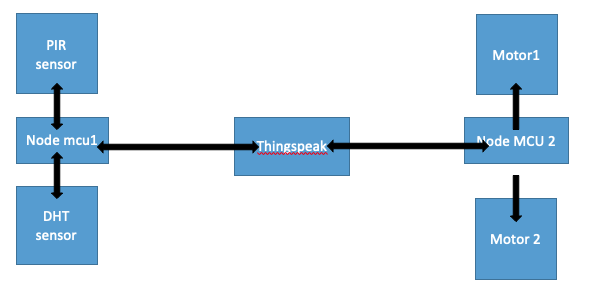
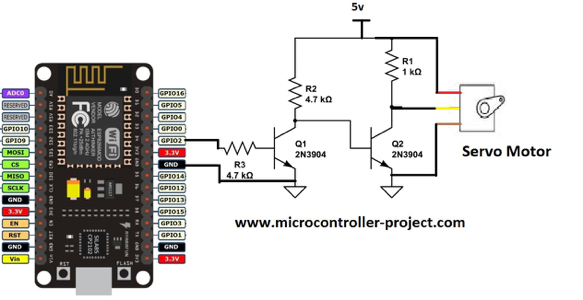
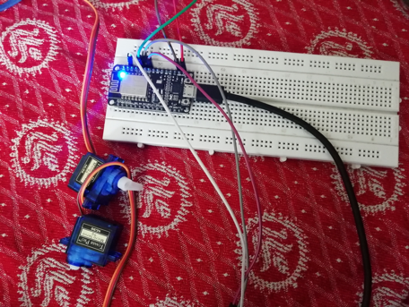
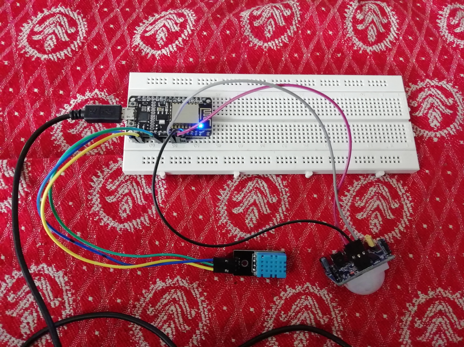

# iot_switch_bot
## Introduction:
In this project we will build a switch bot that will turn on or off the fan by collecting temperature, humidity and PIR values. These values are sent to THINGSPEAK cloud using a NODEMCU and then analysis is done in THINGSPEAK. The THINGSPEAK then triggers the on motor or off motor to move and turn on the switch. This is different from using a relay switch to turn on or off, because using an actuator to turn on the switch is as simple as placing It over a switchboard, rather than changing the entire wiring of the board to introduce the relay into it. 

This is a key component in smart home where fans or air conditioners can be turned on or off as required without human intervention. This is especially useful in cases where people don’t give much attention to turning switches on or off, for example in schools, colleges and offices.

## Project Components:
•	Servo motor
•	Node MCU
•	Temperature sensor
•	Ultra sonic sensor
•	Battery

## Block diagram:

## Working:
•	Initially, the first node MCU continuously collects the data from DHT and PIR sensors. 
•	The values from these sensors are sent to the Thingspeak cloud where analysis is carried out.
•	The output of the analysis is used to trigger the motor connected to nodemcu.
•	The DHT sensor gives temperature and humidity values. Both these values are used to decide whether a fan is useful in that room regardless of the presence of a human being. 
•	 For example, if the room temperature is 10 Degree Celsius, it is obvious to turn off the fan. Then PIR sensor sends the value of movement in the room. 
•	Then, if the room is hot enough and there is no person in the room, then the fan is turned off.
•	If the room is hot enough and there is a person in the room, then the fan is turned off.
•	To achieve this, matlab analysis, react and ThingHttp in thingspeak cloud have been used.
•	Apart from these, rnn was used to predict the presence of a person in an hour, so that the air conditioner is not turned off every time, then person moves out of the room for a break.
•	Using the REACT option, whenever the data is received from nodemcu, matlab analysis is triggered. 
•	The matlab analysis, then writes the motor1 or motor2 values as 1 or 0 into the motor channel.
•	Then a react named m1 which activates when motor 1 is 1 is activated, or react named m2 is activated.
•	This react inturn activates the the thinghttp responsible to turn on the real motors connected to nodemcu.

## Pin diagrams:

## implementation screenshots

